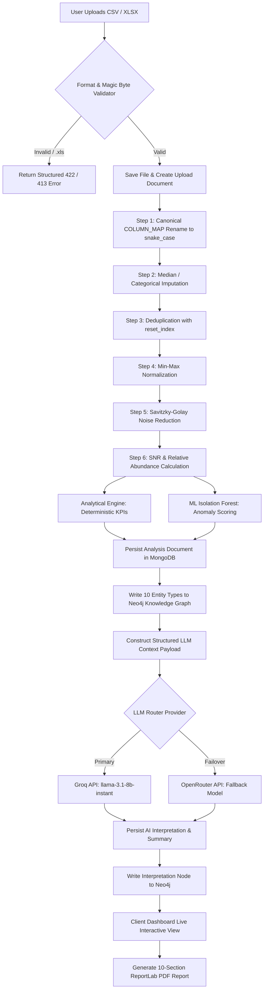
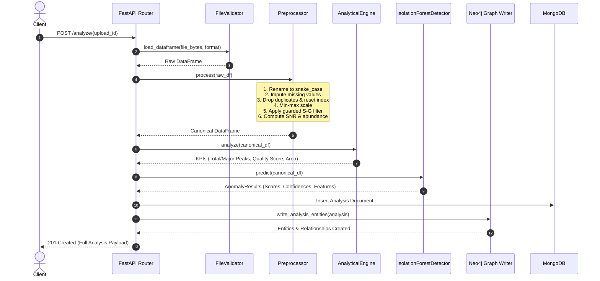
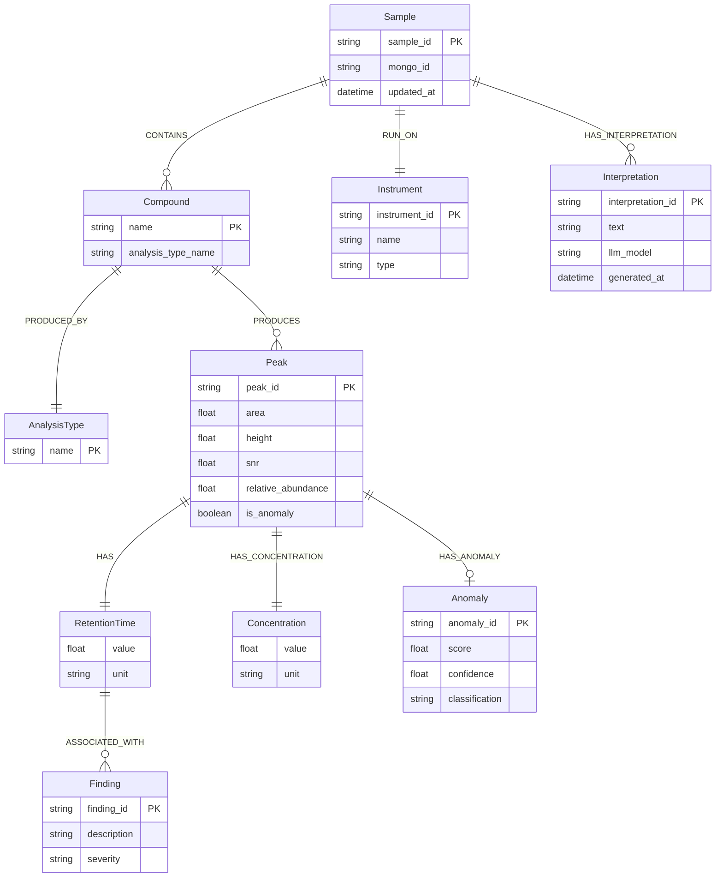

# 🧪 NexusMind — AI-Based Automated Analytical Report Generation & Summarization System

<div align="center">


**An enterprise-grade analytical intelligence platform transforming raw chromatography (HPLC/GC) and Mass Spectrometry data into deterministic insights, graph-backed context, and automated 10-section PDF analytical reports.**

</div>

---

## 📑 Table of Contents
- [Executive Overview](#-executive-overview)
- [End-to-End System Architecture](#-end-to-end-system-architecture)
- [Mermaid Flowcharts](#-mermaid-flowcharts)
  - [1. End-to-End Pipeline Execution Flow](#1-end-to-end-pipeline-execution-flow)
  - [2. Preprocessing & Deterministic Engine Workflow](#2-preprocessing--deterministic-engine-workflow)
  - [3. Knowledge Graph Entity-Relationship Model](#3-knowledge-graph-entity-relationship-model)
- [Core Pipeline Modules](#-core-pipeline-modules)
- [Monorepo Directory Structure](#-monorepo-directory-structure)
- [Quickstart & Execution](#-quickstart--execution)
- [API Endpoints Reference](#-api-endpoints-reference)
- [Automated Testing Suite](#-automated-testing-suite)

---

## 🌟 Executive Overview

Analytical laboratories and chemical manufacturing plants produce thousands of High-Performance Liquid Chromatography (HPLC), Gas Chromatography (GC), and Mass Spectrometry (MS) datasets. Interpreting baseline stability, calculating peak resolution, detecting anomalous contaminants, and assembling compliance reports is manual, labor-intensive, and error-prone.

**NexusMind** automates this entire lifecycle:
1. **Multi-Format Ingestion**: Ingests raw `.csv` and modern `.xlsx` datasets with strict magic-byte and MIME validation.
2. **Deterministic Processing**: Executes a canonical 7-step mathematical pipeline (Savitzky-Golay filtering, SNR, relative abundance) without relying on generative AI for numerical computation.
3. **ML Anomaly Detection**: Uncovers statistical outliers and contamination peaks using an **Isolation Forest** model with positional index alignment.
4. **Neo4j Knowledge Graph**: Automatically structures relationships across **10 entity types** (Samples, Compounds, Peaks, Retention Times, Instruments, Findings, Anomalies, Interpretations).
5. **AI Reasoning & Summarization**: Employs **Groq** (`llama-3.1-8b-instant`) with automatic **OpenRouter** fallback under strict zero-hallucination prompts.
6. **Automated 10-Section PDF Reporting**: Compiles headless-rendered chromatograms and structured findings into publication-ready PDF reports via ReportLab.
7. **Responsive UI**: Built in React 18 using **pure CSS Modules and `:root` design tokens** (strictly no Tailwind/Bootstrap), featuring interactive Plotly chromatograms and stacked mobile layouts.

---

## 🏗️ End-to-End System Architecture

```
                                    +-------------------------------------------------------------+
                                    |              NEXUSMIND ARCHITECTURE OVERVIEW                |
                                    +-------------------------------------------------------------+

   +--------------------------+
   | Raw Data (.csv / .xlsx)  |
   +------------+-------------+
                |
                v
   +--------------------------+         +-------------------------------+
   | Validation & Ingestion   | ------> | Storage Backend (/uploads)    |
   | (MIME / Magic Byte / Cols)         +-------------------------------+
   +------------+-------------+
                |
                v
   +----------------------------------------------------------------------------------------------+
   | Canonical Preprocessing Pipeline (7-Step Strict Sequence)                                     |
   | 1. Title-Case -> snake_case Rename | 2. Imputation | 3. Deduplication | 4. Min-Max Normalize |
   | 5. Guarded Savitzky-Golay Filter   | 6. SNR / Abundance Extraction   | 7. Return Canonical DF|
   +----------------------------------------------------------------------------------------------+
                |
                +------------------------------------+------------------------------------+
                |                                    |                                    |
                v                                    v                                    v
   +--------------------------+         +--------------------------+         +--------------------------+
   | Deterministic Engine     |         | ML Anomaly Detection     |         | MongoDB (ODM Layer)      |
   | Total/Major Peaks        |         | Isolation Forest Model   |         | Document Persistence:    |
   | Resolution Quality Score |         | Positional Index Aligned |         | Uploads, Samples,        |
   | Max Area / Avg Intensity |         | Anomaly Scores & Severity|         | Analyses, Reports        |
   +------------+-------------+         +------------+-------------+         +--------------------------+
                |                                    |
                +-----------------+------------------+
                                  |
                                  v
   +---------------------------------------------------------------+
   | Knowledge Graph Layer (Neo4j Graph Database)                  |
   | Writes 10 Entity Types: Sample, Compound, Peak, RT, Conc,     |
   | Instrument, AnalysisType, Finding, Anomaly, Interpretation     |
   +------------------------------+--------------------------------+
                                  |
                                  v
   +---------------------------------------------------------------+
   | AI Reasoning Layer (LLM Router: Groq -> OpenRouter)           |
   | Strict Prompt: "Do NOT invent or recalculate any numbers"     |
   | Synthesizes chemical observations & actionable recommendations|
   +------------------------------+--------------------------------+
                                  |
                +-----------------+-----------------+
                |                                   |
                v                                   v
   +--------------------------+        +--------------------------+
   | ReportLab 10-Section PDF |        | Modern React 18 Frontend |
   | Headless Matplotlib PNGs |        | Plain CSS Modules        |
   | Download / Preview Stream|        | Interactive Plotly Chart |
   +--------------------------+        +--------------------------+
```

---

## 📊 Mermaid Flowcharts

### 1. End-to-End Pipeline Execution Flow



---

### 2. Preprocessing & Deterministic Engine Workflow



---

### 3. Knowledge Graph Entity-Relationship Model



---

## 🧩 Core Pipeline Modules

| Module | Location | Responsibilities |
|---|---|---|
| **Validation** | `backend/services/validation/validator.py` | Detects `.csv` vs `.xlsx`, rejects `.xls`, checks magic bytes, soft-warns MIME mismatches, enforces spec headers. |
| **Preprocessing** | `backend/services/preprocessing/preprocessor.py` | Step 1 column rename to `snake_case`, median imputation, deduplication with contiguous `reset_index`, S-G smoothing guard, SNR calculation. |
| **Analytics** | `backend/services/analytical/engine.py` | Deterministic computation of peak resolution quality score, total/major peaks (>5%), max area, and average intensity. |
| **Machine Learning** | `backend/services/ml/isolation_forest.py` | Isolation Forest anomaly detection with configurable contamination, random state, and positional alignment. |
| **Knowledge Graph** | `backend/services/graph/` | Schema uniqueness constraints for all 10 entity types, separate write routines (`write_analysis_entities`, `write_interpretation`), Cypher context queries. |
| **AI LLM Layer** | `backend/services/llm/` | Groq `llama-3.1-8b-instant` primary with OpenRouter fallback via `LLMRouter`; zero-hallucination prompt builder. |
| **PDF Reporting** | `backend/services/report/` | Headless Matplotlib chart rendering and 10-section ReportLab PDF generation. |
| **Frontend UI** | `frontend/src/features/` | React 18 SPA with plain CSS Modules, design tokens in `tokens.css`, Plotly chromatograms, stacked mobile cards, and standalone PDF preview. |

---

## 📁 Monorepo Directory Structure

```
.
├── .gitignore                          # Root ignore file (ignores Doc, .agents, venv, node_modules)
├── Readme.md                           # Master project documentation
│
└── Code/
    └── Development/
        ├── docker-compose.yml          # Consolidated 4-service Docker Compose
        ├── .env.example                # Documented configuration template
        ├── .gitignore                  # Development ignore
        ├── README.md                   # Development quickstart
        ├── run_project.bat             # 1-Click local development launcher
        ├── deploy.bat                  # Multi-mode deployment launcher (WiFi / Tunnel / Prod / Docker)
        │
        ├── backend/                    # Python / FastAPI Backend
        │   ├── Dockerfile
        │   ├── requirements.txt
        │   ├── main.py                 # FastAPI application factory & routers
        │   ├── config.py               # pydantic-settings configuration
        │   ├── api/                    # Route handlers (health, upload, analyze, kpi, anomaly, graph, summary, report, history)
        │   ├── core/                   # Domain exceptions & responses
        │   ├── db/                     # MongoDB (Motor/Beanie) & Neo4j AsyncDriver
        │   ├── services/               # Validation, Preprocessor, Analytics, ML, Graph, LLM, Report
        │   └── tests/                  # 13 automated unit & regression tests
        │
        └── frontend/                   # React 18 / Vite Frontend
            ├── Dockerfile              # Multi-stage build + Nginx static serve
            ├── nginx.conf              # SPA fallback routing
            ├── package.json
            ├── vite.config.js
            └── src/
                ├── styles/tokens.css   # :root Design Tokens & Responsive Breakpoints
                ├── index.css           # CSS Resets
                ├── api/                # Centralized Axios client modules
                └── features/           # Feature-folder layout (layout, upload, dashboard, graph, ai, report, history, pages)
```

---

## ⚡ Quickstart & Execution

### Option 1: One-Click Launch (Windows Local Dev)
Inside `Code/Development/`:
```cmd
run_project.bat
```
*Starts FastAPI backend on port 8000, React dev server on port 5173, and launches your browser.*

---

### Option 2: Interactive Deployment Menu
Inside `Code/Development/`:
```cmd
deploy.bat
```
*Provides 4 interactive deployment modes: Local WiFi shareable, Cloudflare Public HTTPS Tunnel, Local Production Build Preview, or Full Containerized Docker Stack.*

---

### Option 3: Production Docker Stack
Inside `Code/Development/`:
```bash
cp .env.example .env
# Edit .env to add your GROQ_API_KEY
docker-compose up --build
```
- **Web Dashboard**: `http://localhost:8080`
- **Backend API Docs**: `http://localhost:8000/docs`

---

## 📡 API Endpoints Reference

| Method | Endpoint | Description |
|---|---|---|
| `GET` | `/api/v1/health` | Service health status (MongoDB ping, Neo4j ping) |
| `POST` | `/api/v1/upload` | Multipart file ingestion (`.csv`, `.xlsx`) |
| `POST` | `/api/v1/analyze/{upload_id}` | Runs preprocessing, analytical engine, ML anomaly detector, & KG sync |
| `GET` | `/api/v1/analysis/{analysis_id}` | Retrieves full analysis document & calculated KPIs |
| `GET` | `/api/v1/kpi/{analysis_id}` | Retrieves calculated chromatographic metrics |
| `GET` | `/api/v1/anomaly/{analysis_id}` | Retrieves Isolation Forest anomaly detection results |
| `GET` | `/api/v1/graph/{analysis_id}` | Retrieves Knowledge Graph context & visualization network |
| `POST` | `/api/v1/summary/{analysis_id}` | Generates AI reasoning interpretation via Groq/OpenRouter |
| `POST` | `/api/v1/report/{analysis_id}` | Compiles automated 10-section ReportLab PDF report |
| `GET` | `/api/v1/report/{report_id}/download`| Streams generated PDF report |
| `GET` | `/api/v1/history` | Paginated list of historical analytical runs |

---

## 🧪 Automated Testing Suite

To run all automated unit and regression tests:
```bash
cd Code/Development/backend
python -m pytest tests/ -v --tb=short
```

### Test Coverage Results:
```text
============================= test session starts =============================
tests/test_analytical_engine.py::test_analytical_engine_determinism PASSED [  7%]
tests/test_anomaly_detection.py::test_planted_outlier_detection PASSED   [ 15%]
tests/test_anomaly_detection.py::test_index_alignment_after_dedup PASSED [ 23%]
tests/test_llm_payload.py::test_system_prompt_numeric_guard PASSED       [ 30%]
tests/test_llm_payload.py::test_payload_builder_structure PASSED         [ 38%]
tests/test_llm_payload.py::test_llm_router_failover PASSED               [ 46%]
tests/test_preprocessing.py::test_preprocessing_canonical_schema_and_features PASSED [ 53%]
tests/test_preprocessing.py::test_savgol_small_dataset_guard PASSED      [ 61%]
tests/test_validation.py::test_validate_csv_success PASSED               [ 69%]
tests/test_validation.py::test_validate_xlsx_success PASSED              [ 76%]
tests/test_validation.py::test_reject_xls_format PASSED                  [ 84%]
tests/test_validation.py::test_missing_required_column PASSED            [ 92%]
tests/test_validation.py::test_mime_warning_non_blocking PASSED          [100%]
============================= 13 passed in 1.78s ==============================
```

---

## 📄 License
Enterprise Analytical Software — Proprietary. All Rights Reserved.
